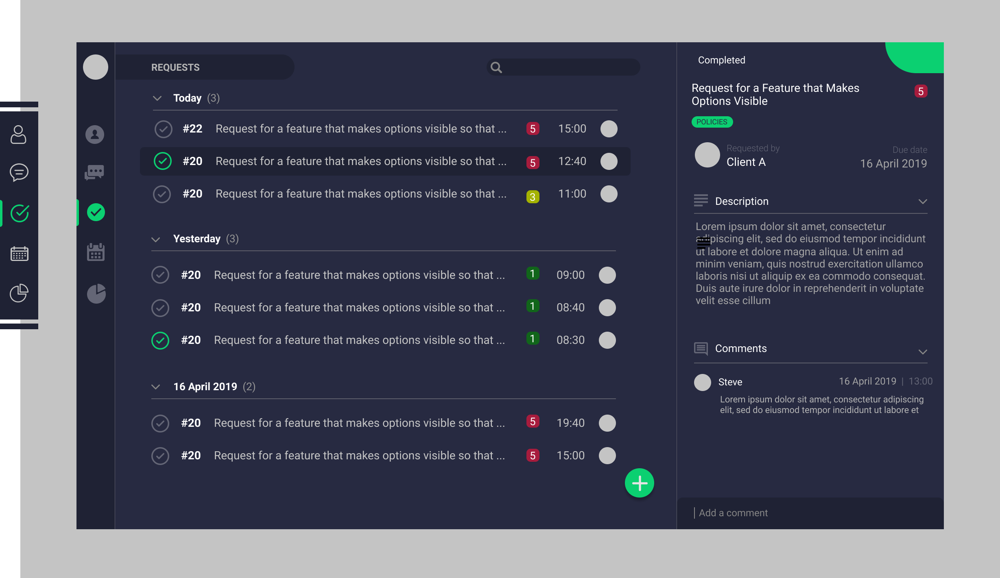

<h1 align="center">REQUESTS</h1>



Requests is part of a larger application. It allows the staff of an imaginary company to register and track client's feature requests.

See Requests running [here](...)


### INSTALLATION
##### REQUIREMENTS
- [Python 3.7+](https://www.python.org/downloads/) - Python interpreter
- [Pip](https://pip.pypa.io/en/stable/installing/) (Should be installed along with Python) - Python package manager
- [Nodejs](https://nodejs.org/en/download/) - Javascript server-side Virtual Machine
- [NPM](https://docs.npmjs.com/downloading-and-installing-node-js-and-npm) (Should be installed along with Nodejs) - Nodejs package manager
- [PostgreSQL](https://www.postgresql.org/download/) - Database management system

##### STEPS
- Clone the repository
    ```bash
    git clone https://www.github.com/appcypher/requests.git
    ```

- Change working directory to project's directory
    ```bash
    cd requests
    ```

- Create `requests` and `requests_test` databases

- Install dependecies and build project
    ```bash
    . requests.sh build
    ```

- Activate the project's virtual environment.
    ```bash
    pipenv shell
    ```

- Start the flask app
    ```bash
    flask run
    ```

- Run tests
    ```bash
    pytest
    ```


### STARTING UP DOCKER CONTAINERS
##### REQUIREMENTS
- [Docker](https://docs.docker.com/v17.12/install/)


##### STEPS
- Start all the project's containers togther with docker-compose
    ```bash
    docker-compose -f docker/compose.yml up
    ```

- You can also build and start them individually

- Build and start flask app container
    ```bash
    docker image build -t flask-app:latest -f ./docker/app/Dockerfile ./
    ```

    ```bash
    docker container create --name flask-app -p 80:80 flask-app
    ```

    ```bash
    docker container start flask-app
    ```

- Build and start nginx server container
    ```bash
    docker image build -t nginx-server:latest -f ./docker/server/Dockerfile ./docker/server/
    ```

    ```bash
    docker container create --name nginx-server -p 80:80 nginx-server
    ```

    ```bash
    docker container start nginx-server
    ```


### DEPLOYMENT TO [AWS ECS]()
This project contains a set of AWS specific files (`buildspec.yml` and `deploy.sh`) for automating CI/CD deployment. The deployment process relies on the following AWS automation services:
- CodePipeline ...
- CodeBuild ...
- CodeDeploy ...
- CodeCommit ...

##### REQUIREMENTS
- [AWS ECS](https://aws.amazon.com/ecs/) - Amazon container orchestration services
- [AWS ECR](https://aws.amazon.com/ecr/) - Amazon docker container registry
- [Github](https://github.com/) - Git repository hub
- [ECS CLI](https://docs.aws.amazon.com/AmazonECS/latest/developerguide/ECS_CLI_installation.html) - Command line tool managing Amazon ECS setup remotely

##### STEPS
- Start

### AVAILABLE TASK RUNNERS
- ```flask model seed all``` → Seeds the database with important initial data
- ```npm run build:dev:watch``` → Builds the frontend code with optimizations turned on and sourcemap
- ```npm run build:dev:watch``` → Watches the frontend code for any change and rebuilds with debug options activated for development ease


### API
Check [here](...) for more information

##### REQUESTS
- GET: ```/api/v1/requests``` → Gets all the requests
- POST: ```/api/v1/requests``` → Saves requests
- GET: ```/api/v1/requests/:id``` → Gets a request with specified id

##### REQUESTS
- GET: ```/api/v1/requests/:id/comments``` → Gets all the comments under a request
- GET: ```/api/v1/requests/:id/comments``` →  Adds a new comment under a request

##### STAFF
- GET: ```/api/v1/staff/:id``` →  Gets a request with specified id

##### CLIENT
- GET: ```/api/v1/client/:id``` →  Adds a new comment under a request


### MADE WITH
##### MOCKUP
- ```Figma``` → Cloud-based design tool

##### CLIENT
- ```Knockout``` → MVVM-based JavaScript library
- ```JQuery``` → A fast, small and feature-rich JavaScript library
- ```Webpack``` → Package bundler with minification
- ```SCSS``` → Flexible superset of CSS

##### SERVER
- ```Flask``` → Micro web framework for Python
- ```SQLAlchelmy``` → SQL database ORM
- ```Marshmallow``` → Serialization and validation tool
- ```Gunicorn``` → WSGI-compliant web server
- ```Nginx``` → Web server for reverse proxying, load balancing, caching and more

##### DATABASE
- ```PostgreSQL``` → Database management system

##### CI/CD
- ```Docker``` → Container and image creation and management tool
- ```Travis``` → Continous integration services
- ```CodeClimate``` → Code maintenance and coverage services
- ```Coveralls``` → Code coverage report services
- ```Amazon ECS``` → Amazon's container orchestration services
- ```Amazon CodePipeline, CodeBuild, CodeDeploy, CodeCommit``` → A set of AWS automation services for CI/CD

##### TESTS
- ```Pytest``` → Testing framework


### LICENSE
[Apache License 2.0](LICENSE)
