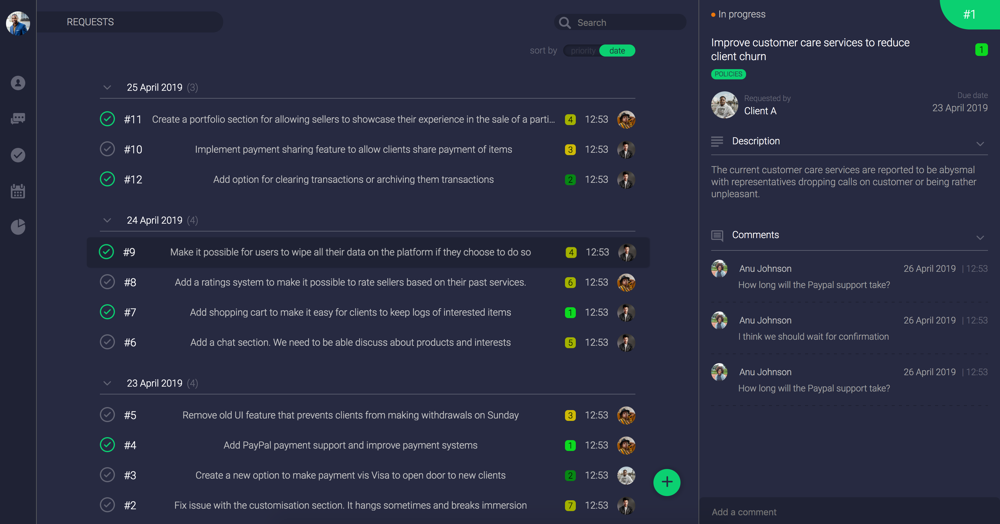

<h1 align="center">REQUESTS</h1>



You can find the mockups [here](https://www.figma.com/file/CEAsuJTXG1nRShKSMkLdRW4U/Untitled?node-id=0%3A1)


[](https://circleci.com/gh/appcypher/requests)
[](https://coveralls.io/github/appcypher/requests?branch=master)
[](https://codeclimate.com/github/appcypher/requests/maintainability)


Requests is part of a larger application. It allows the staff of an imaginary company to register and track clients feature requests.

See Requests running [here](http://requests2-env.ytcuuufw3p.us-east-2.elasticbeanstalk.com/)


### 🛠 INSTALLATION
##### REQUIREMENTS
- [Python 3.7+](https://www.python.org/downloads/) - Python interpreter
- [Pip](https://pip.pypa.io/en/stable/installing/) (Should be installed along with Python) - Python package manager
- [Nodejs](https://nodejs.org/en/download/) - Javascript server-side Virtual Machine
- [NPM](https://docs.npmjs.com/downloading-and-installing-node-js-and-npm) (Should be installed along with Nodejs) - Nodejs package manager
- [PostgreSQL](https://www.postgresql.org/download/) - Database management system

##### STEPS
- Clone the repository
    ```bash
    git clone https://www.github.com/appcypher/requests.git
    ```

- Change working directory to project's directory
    ```bash
    cd requests
    ```

- Create `requests` and `requests_test` databases

- Install dependecies and build project
    ```bash
    . requests.sh build
    ```

- Activate the project's virtual environment.
    ```bash
    pipenv shell
    ```

- Apply migration files.
    ```bash
    flask db upgrade -d server/migrations
    ```

- Add seeds to the database.
    ```bash
    flask model seed all
    ```

- Start the flask app
    ```bash
    flask run
    ```

- Visit `localhost:5000` on your browser to see the page.


### ✅ TESTING
##### REQUIREMENTS
- Same as [installation](#-installation) requirements.

##### STEPS
- You can run all the tests in a single command.
    ```bash
    pipenv shell
    ```

    ```bash
    pytest
    ```

    Some useful defaults are already set in [pytest.ini file](pytest.ini)

- The tests are all unit tests, so you can run them individually
    ```bash
    pytest -k test_client_model_gets_all_rows_correctly_after_saving
    ```


### 📦 STARTING UP DOCKER CONTAINERS
##### REQUIREMENTS
- [Docker](https://docs.docker.com/v17.12/install/)


##### STEPS
- Start all the project's containers together with docker-compose
    ```bash
    docker-compose -f docker/compose.yml up
    ```

- You can also build and start them individually

- Build and start flask app container
    ```bash
    docker image build -t flask-app:latest -f ./docker/app/Dockerfile ./
    ```

    ```bash
    docker container create --name flask-app -p 80:80 flask-app
    ```

    ```bash
    docker container start flask-app
    ```

- Build and start nginx server container
    ```bash
    docker image build -t nginx-server:latest -f ./docker/server/Dockerfile ./docker/server/
    ```

    ```bash
    docker container create --name nginx-server -p 80:80 nginx-server
    ```

    ```bash
    docker container start nginx-server
    ```


### 🚀 DEPLOYMENT TO [AWS ECS](https://aws.amazon.com/ecs/)
This project contains a buildspec.yml file for automating deployment. The deployment process relies on a few AWS automation services CodePipeline, CodeBuild. Ideally the buildspec file needs to be customized for your use case.

However, if you are willing to take the manual approach, you can follow the steps below.

##### REQUIREMENTS
- [AWS](https://aws.amazon.com) - Amazon web services
- [Github](https://github.com/) - Git repository hub
- [AWS EB CLI](https://docs.aws.amazon.com/elasticbeanstalk/latest/dg/eb-cli3-install.html) - Command line tool for managing Amazon Elastic Beanstalk (EB) applications remotely

##### STEPS
- For the following to work, you need to have [configured](https://docs.aws.amazon.com/cli/latest/userguide/cli-chap-configure.html) your AWS CLI using your EC2 [keypairs](https://docs.aws.amazon.com/AWSEC2/latest/UserGuide/ec2-key-pairs.html).

- Initialize the platform by following the prompt given by
    ```bash
    eb init
    ```

- Create an environement.
    ```
    eb create request_app_environment
    ```

- Deploy the application.
    ```bash
    eb deploy
    ```


### ⚙️ AVAILABLE TASK RUNNERS
- ```flask model seed all``` → Seeds the database with relevant initial data
- ```npm run build:prod``` → Builds the frontend code with optimizations turned on and generates a sourcemap
- ```npm run build:dev:watch``` → Watches the frontend code for any change and rebuilds with debug options enabled
- ```sh requests.sh --help``` → Shows helpful information about `requests.sh` script
- ```sh requests.sh build``` → Downloads and builds the projects dependencies
- ```sh requests.sh start``` → Starts the flask application using a Gunicorn (wsgi) server


### ↔️ API
- A detailed documentation of the API is available [here](https://documenter.getpostman.com/view/4928310/S1EQSHJX).

- You can also have access to the project's Postman collection with the button below.

    [](https://app.getpostman.com/run-collection/84067ae32777b6dea8ef)

- This project doesn't do any user authentication, it is assumed the larger app has this figured out already.

##### REQUESTS
- GET: ```/api/v1/requests``` → Gets all the requests
- POST: ```/api/v1/requests``` → Saves a request
- GET: ```/api/v1/requests/:id``` → Gets the request with the specified id

##### COMMENTS
- GET: ```/api/v1/requests/:id/comments``` → Gets all the comments under a request
- POST: ```/api/v1/requests/:id/comments``` →  Adds a new comment under a request

##### STAFF
- GET: ```/api/v1/staff/:id``` →  Gets the staff with the specified id

##### CLIENT
- GET: ```/api/v1/client/:id``` →  Gets the client with the specified id


### 🥘 MADE WITH
##### MOCKUP
- ```Figma``` → Cloud-based design tool

##### CLIENT
- ```Knockout``` → MVVM-based JavaScript library
- ```JQuery``` → A fast, small and feature-rich JavaScript library
- ```Webpack``` → Package bundler with minification
- ```SCSS``` → Flexible superset of CSS

##### SERVER
- ```Flask``` → Micro web framework for Python
- ```SQLAlchemy``` → SQL database ORM
- ```Marshmallow``` → Serialization and validation tool
- ```Gunicorn``` → WSGI-compliant web server
- ```Nginx``` → Web server for reverse proxying, load balancing, caching and more

##### DATABASE
- ```PostgreSQL``` → Database management system

##### CI/CD
- ```Docker``` → Container and image creation and management tool
- ```Travis``` → Continous integration services
- ```CodeClimate``` → Code maintenance and coverage services
- ```Coveralls``` → Code coverage report services
- ```Amazon ECS``` → Amazon's container orchestration services
- ```Amazon CodePipeline, CodeBuild, CodeDeploy, CodeCommit``` → A set of AWS automation services for CI/CD

##### TESTS
- ```Pytest``` → Testing framework


### 👍 CREDITS
This project looks nicer; thanks to the free icons and logos provided by these awesome [creators](CREDITS.md)


### 🤝 LICENSE
[Apache License 2.0](LICENSE)
